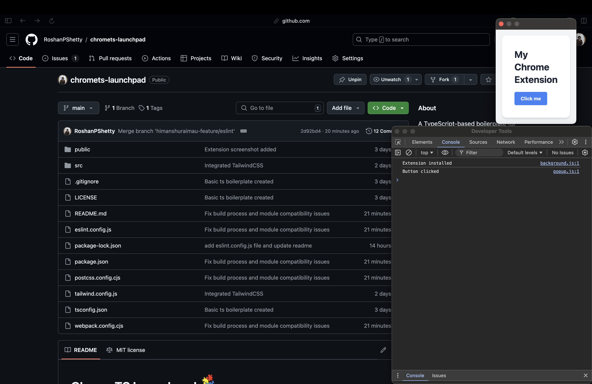

# ChromeTS Launchpad 


ChromeTS Launchpad is a modern, TypeScript-based boilerplate for creating Chrome Extensions. It provides a solid foundation for building extensions with type safety, modern JavaScript features, and sleek styling using Tailwind CSS.

## Purpose

The primary purpose of ChromeTS Launchpad is to streamline the process of developing Chrome extensions using TypeScript. It aims to:

1. Provide a well-structured starting point for Chrome extension development
2. Leverage TypeScript for improved code quality and developer experience
3. Incorporate best practices and modern tooling for extension development
4. Offer easy and flexible styling with Tailwind CSS

## What This Extension Does

This boilerplate extension includes basic functionality to demonstrate core Chrome extension features:

1. A background script that logs when the extension is installed
2. A content script that can interact with web pages
3. A popup with a simple button interaction
4. An options page for extension configuration
5. Integration with Chrome's Storage API for saving settings
6. Tailwind CSS for quick and responsive styling



*Developers can easily build upon this foundation to create more complex and feature-rich extensions.*

## Why TypeScript

TypeScript is a modern, statically typed programming language that provides type safety and improved developer experience. It is used in this boilerplate extension to enhance code quality and maintainability.

## Why Manifest V3

ChromeTS Launchpad uses Manifest V3, the latest version of Chrome's extension platform. Here's why:

1. **Enhanced Security**: Manifest V3 improves extension security through more granular permissions and limited access to powerful APIs.
2. **Better Performance**: It promotes the use of service workers for background processes, leading to reduced memory usage and improved overall browser performance.
3. **Future-Proofing**: As the new standard for Chrome extensions, Manifest V3 ensures long-term compatibility and support.
4. **Improved User Privacy**: It provides users with more control over when and how extensions can access site data.
5. **Modern Web Technologies**: Manifest V3 aligns more closely with current web development practices and standards.

By using Manifest V3, ChromeTS Launchpad ensures that extensions built with it are up-to-date, secure, and performant.

## Features

- TypeScript support
- Webpack for bundling
- Tailwind CSS for styling
- Background script
- Content script
- Popup page
- Options page
- Chrome Storage API integration

## Getting Started

### Prerequisites

- Node.js (v14 or later)
- npm (v6 or later)

### Installation

1. Clone the repository:
   ```bash
   git clone https://github.com/yourusername/ChromeTS-Launchpad.git
   ```

2. Navigate to the project directory:
   ```bash
   cd ChromeTS-Launchpad
   ```

3. Install dependencies:
   ```bash
   npm install
   ```

### Development

Run the development build with hot reloading:
```bash
npm run watch
```

### Production Build

To create a production build:
```bash
npm run build
```

This will generate optimized files in the `dist` folder.

### Loading the Extension in Chrome

1. Open Chrome and navigate to `chrome://extensions`
2. Enable "Developer mode"
3. Click "Load unpacked" and select the `dist` folder in your project directory

## Customization

- Modify the TypeScript files in the `src` folder to add your extension's functionality
- Update the HTML files in the `popup` and `options` folders
- Utilize Tailwind CSS classes to style your HTML elements
- Adjust the `tailwind.config.js` file to customize your Tailwind setup
- Modify the `manifest.json` file to change extension metadata, permissions, and other settings

## Future Implementations

- ESLint for linting and code style
- MV3 Boilerplate w/ React/Vue/Solid/Svelte/Preact Templates

## Contributing

Contributions are welcome and greatly appreciated! If you're looking to contribute, here are some good first issues to get you started:

### Good First Issues

1. **Add ESLint to improve code quality and consistency**
   - Integrate ESLint into the project to enforce coding standards and catch potential errors early in the development process.
   - [View Issue](https://github.com/RoshanPShetty/ChromeTS-Launchpad/issues/[ISSUE_NUMBER])

2. **Add Jest for unit testing TypeScript code**
   - Set up Jest testing framework to enable unit testing for TypeScript code in the project.
   - [View Issue](https://github.com/RoshanPShetty/ChromeTS-Launchpad/issues/[ISSUE_NUMBER])

To contribute:

1. Fork the project
2. Create your feature branch (`git checkout -b feature/AmazingFeature`)
3. Commit your changes (`git commit -m 'Add some AmazingFeature'`)
4. Push to the branch (`git push origin feature/AmazingFeature`)
5. Open a Pull Request

For more detailed information on contributing, please see our [CONTRIBUTING.md](CONTRIBUTING.md) file.

## License

This project is licensed under the MIT License - see the [LICENSE](LICENSE) file for details.
